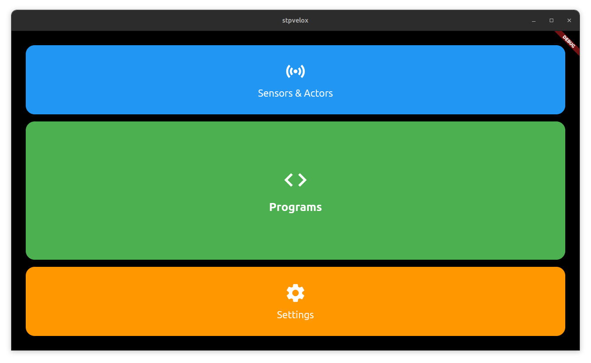

# StpOS



> Developed for Botball. Battle-tested at ECERs and GCERs. Released for anyone crazy enough to try it.
> More screenshots can be found in the `assets/` folder

StpOS is the operating system from **HTL St. Pölten**, primarily developed by **Tobias Madlberger**.
It's the core of our robotics systems - a true Frankenstein’s monster of code, stitched together from old repos, hard drive folders, and long lost prototypes.

The first version emerged shortly after **ECER 2023**, hacked together over a summer break. Since then, it has evolved through years of competitions, debugging sessions, and questionable quick fixes - especially in the leadup to **ECER 2024**.

If StpOS had a development philosophy, it would be:

> **"If it works, it ships."** (Not that good in hindsight)

By the time we were preparing for **GCER 2025**, the system had finally matured into something that could be used without a month-long crash course in "How to Survive This Mess™" (I am talking about the user facing stuff, like the python wrapper and the ui, the code itself....). Every single line has been broken and patched (sometimes several times) in real-world competition conditions.

Now, after years of service, the code is... well....... functional, but ugly, tangled, and deeply specialized. Dropping it into another team's robot will require serious time, knowledge, and patience. That's why StpOS is retiring.

We're releasing it here not as a plug-and-play solution, but as a look at a fully-featured, battle-tested Botball OS.
To our knowledge, it's the first major open Botball library of its kind.

## Why Open Source Matters (Even in Competitions)

Botball is an **educational** robotics competition. That means it’s about learning, sharing, and growing as a community - not just hiding your code until the season is over.

When resources are scarce, every team is forced to reinvent the wheel instead of learning from each other’s progress. By sharing tools like StpOS, we make it possible for new teams to get started faster, for experienced teams to refine ideas, and for *everyone* to raise the bar of what’s possible.

> Without open resources, how can we learn?
> Without seeing examples, how can we improve?

I can’t force anyone to open source their work - and I know not every team wants to share everything.
But if you take inspiration from StpOS, or reuse ideas from it, I’d really appreciate it if you’d try to **give something back to the community** in return.
Even small contributions, snippets, or examples can make a huge difference for the next team trying to figure this stuff out.

## The Future

This is not the end of StpOS. Work is already underway on a **completely re-engineered, cleaner, and far more maintainable** successor.
Once it’s ready for daylight, the improved version will also be **open-sourced** - keeping the spirit of StpOS alive without the two years of accumulated duct tape.

The new version will be an actual plug-and-play system.

## About the OS itself

Technical Dt boots significantly faster (~20 30 seconds total), is based on Debian Bookworm (instead of Bullseye), has full support for libwallaby. When installing, it may require reflashing the Wombat with the modified firmware that includes the gyro fix (Already in the flashfiles folder). Compatibleetails: The UI is written in Flutter a cross-platform framework typically used for mobile/web apps. Instead of using a window manager or X11/Wayland, the app is rendered directly to the framebuffer via a custom embedder, eliminating the need for a desktop environment. This reduces system overhead and boot time while keeping the UI highly responsive and visually modern. 

Current UI Work-in-Progress: Wi-Fi Access Point toggle and LAN mode, better Wi-Fi management UI, improved motor and servo control UIs, camera integration.

Note: No web UI is included yet; To get to the console, you have to go to `Settings > Hide UI`. User is `pi`, password is `raspberrypi` - External keyboard needed.

### Installation

Flash the image onto your wombat via balena etcher or another sd card flashing program and boot the device.

Download link: [Google Drive OS Image](https://drive.google.com/file/d/1rmbLGlc6lTqmyeEW4bo3VWqcZ30lUt-8/view?usp=sharing)

## Project Structure

The repo is divided into three main parts:

* **`ui/`** — Wombat controller UI
* **`library/`** — The C++/Python hybrid monster (`LibStp`) powering robots mid-run
* **`examples/`** — Full source of our **GCER 2025** bot (*Potato Bot*)
* **`image-creator/`** - Documentation on how to create a stpos image from scratch
* **`firmware`** - The firmware used on the stm32

## A Word of Warning

This is **not** plug-and-play.
It will not run out-of-the-box without hours of setup, debugging, and adaptation to your own hardware.

If you’re willing to put in the work, you’ll find a system with:

* Proven competition reliability
* Years of iterative improvement
* Solutions to real, field-tested robotics problems

## Features (from memory)

* Precision straight-line driving
* Accurate rotations
* Non-binary line following
* Non-binary lineups
* Smooth, slow servo movements
* Single-threaded async operations
* Robot checkpoint synchronization
* Sequential programming framework

## Example: *Potato Bot* Mission

```python
class DriveToTraysMission(Mission):
    def sequence(self) -> Sequential:
        return seq([
            drive_backward(0.7, 1),
            parallel(
                drive_backward(2, 1),
                motor("box_Motor", -30, 1),
            ),

            turn_cw(90, 1),

            prep_for_drop(Defs.box_Motor, Defs.potato_sensor),
            motor(Defs.box_Motor, -75, 0.3),
            stop_motor(Defs.box_Motor),

            wait_for_checkpoint(51),

            follow_line(1.5, 1, "l_sensor", "r_sensor"),
            follow_line_until_both_black(1, "l_sensor", "r_sensor"),
            turn_ccw(90, 1),
            drive_forward(1.4, 1),
            drive_backward(0.2, 1),
            turn_cw(87, 1),

            drive_forward(2.1, 1),
        ])
```
