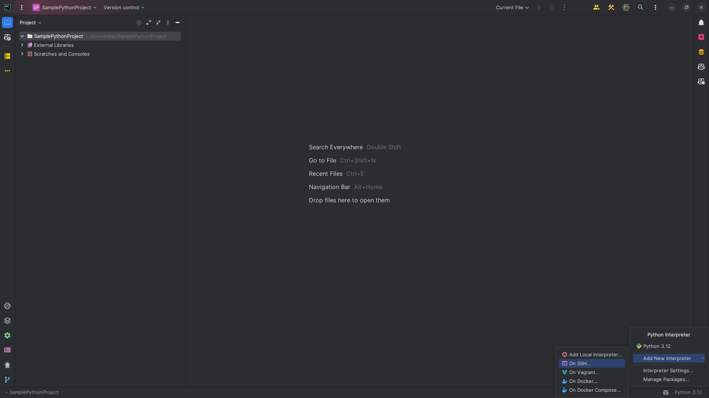
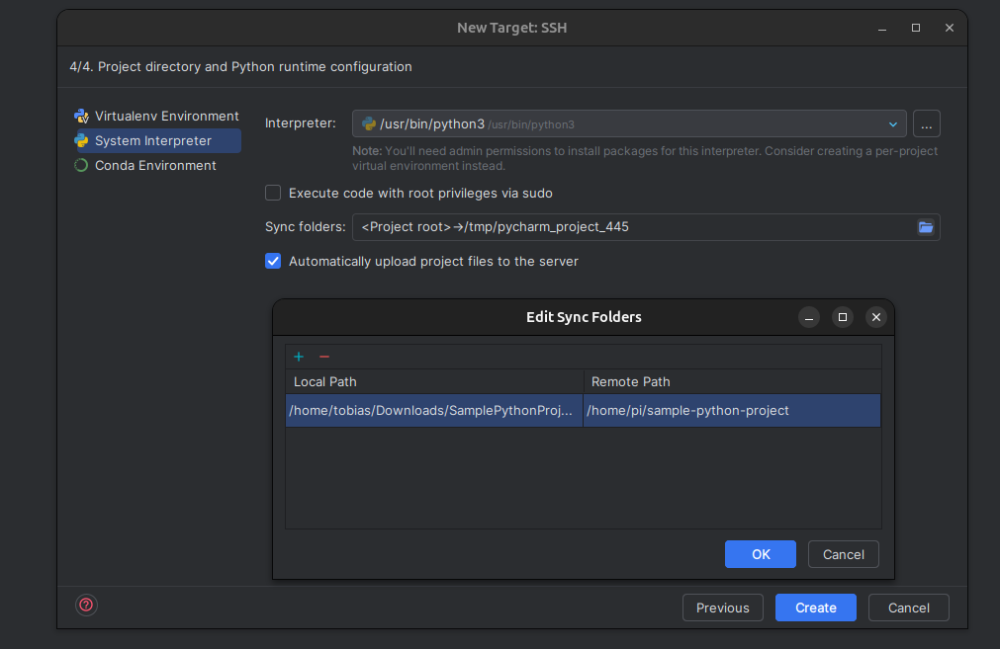
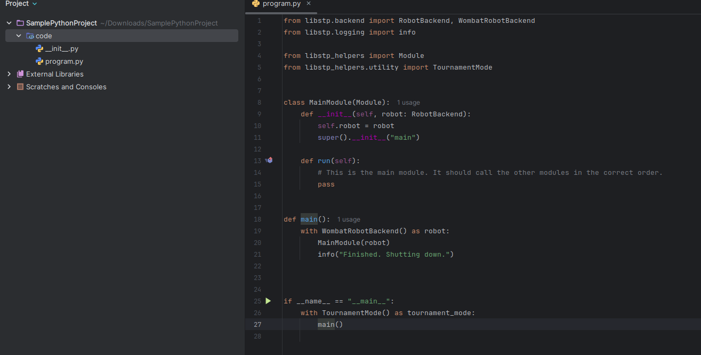
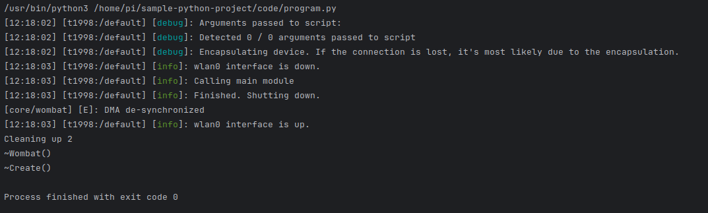

# Create the initial sd card

Use the raspberry pi imager tool to create the initial sd card. Use the raspberry pi os lite 64 bit version. Configure
the hostname, user and password. Setup the wifi, locale and enable ssh.

> Apparently, the bookworm and higher versions of debian no longer support the old way of writing to gpio pins.
> For now, use a legacy version, like bullseye. But in the future, consider changing the flashing process

# First time start

Now start the pi with the sd card - The first time start will take ~ 5 minutes with a few reboots. The display will have
scan lines - But don't worry, they'll get fixed in the next step.

# Run `setup-image.py`

To transfer all relevant files, run the `setup-image.py` script. This will copy the files needed files in the correct
folders automatically.

```bash
python3 setup-image.py -m <Boot Partition>
```

Example (Linux)

```bash
python3 setup-image.py -m /media/tobias/bootfs
```

This copies the files `config.txt` and `tsc2007-overlay.dts` to the boot partition.

# Setup touch display (Dev Machine)

Make sure to have your SD card plugged in to your host machine with a reader or other device.

## Requirements

```bash
sudo apt install git bc bison flex libssl-dev make libc6-dev libncurses5-dev -y
sudo apt install crossbuild-essential-arm64 -y
```

## Clone Repositories

The Raspberry Pi Linux repository is fairly large and may take some time to download

```bash
git clone --depth=1 https://github.com/raspberrypi/linux
git clone https://github.com/kipr/wombat-os
```

## Build Kernel

```bash
cd linux
make ARCH=arm64 CROSS_COMPILE=aarch64-linux-gnu- bcm2711_defconfig
```

### Add Config Files

```bash
`sed -i 's/# CONFIG_TOUCHSCREEN_TSC2007 is not set/CONFIG_TOUCHSCREEN_TSC2007=m/' .config
sudo cp wombat-os/configFiles/tsc2007-overlay.dts linux/arch/arm64/boot/dts/overlays/tsc2007-overlay.dts
sudo cp wombat-os/configFiles/Makefile linux/arch/arm64/boot/dts/overlays/Makefile`
```

### Copy Files to Boot and Root

Give permissions to mnt directory

```bash
sudo chmod 777 mnt
```

Make sure your mount directories are actually mmcblk0p1 and not something else

```bash
lsblk
```

```bash
mkdir mnt && mkdir mnt/boot && mkdir mnt/root
sudo mount /dev/mmcblk0p1 mnt/boot # Check if device actually corresponds to it
sudo mount /dev/mmcblk0p2 mnt/root # Check if device actually corresponds to it
```

```bash
sudo chmod 777 mnt/root/etc/modules
sudo echo 'tsc2007' >> mnt/root/etc/modules
```

Note: Depending on your machine, you may want to up this to higher than j12 for this build (j12 - 12 is the core count
you want to use for compiling)

```bash
# Define mount point variables
MNT_BOOT="/media/tobias/bootfs"
MNT_ROOT="/media/tobias/rootfs"

cd linux
KERNEL=kernel8

# Build kernel and modules
sudo make -j12 ARCH=arm64 CROSS_COMPILE=aarch64-linux-gnu- Image modules dtbs

# Install modules
sudo env PATH=$PATH make -j12 ARCH=arm64 CROSS_COMPILE=aarch64-linux-gnu- INSTALL_MOD_PATH=$MNT_ROOT modules_install

# Backup existing kernel
sudo cp $MNT_BOOT/$KERNEL.img $MNT_BOOT/$KERNEL-backup.img

# Copy kernel image
sudo cp arch/arm64/boot/Image $MNT_BOOT/$KERNEL.img

# Copy device tree files
sudo cp arch/arm64/boot/dts/broadcom/*.dtb $MNT_BOOT/
sudo cp arch/arm64/boot/dts/overlays/*.dtb* $MNT_BOOT/overlays/
sudo cp arch/arm/boot/dts/overlays/README $MNT_BOOT/overlays/

```

Unmount boot and root then unplug micro SD card.

```bash
sudo umount mnt/boot
sudo umount mnt/root
```

# Start

Now you can start the pi and connect via ssh. The display should be fine now.

# On Device setup

Now oyu have to configure the device's stm32.

## Install stm32flash

```bash
sudo apt update
sudo apt install stm32flash
```

## Enable serial ports

`sudo raspi-config` -> Interface Options -> Serial Port
login shell accessible over serial? -> **NO**
serial port hardware to be enabled? -> **YES**

## Flash Device

run:

```
cd ~/flashFiles
sudo sh ./wallaby_flash
```

> In some cases the gpio pins just don't work (Giving I/O or Write errors). Never found out what caused the issue,
> rebooting fixed it usually. Make sure you're on bullseye or another platform that supports the old way of writing to
> gpio pins.

# Install python

```bash
sudo apt-get install python3 python3-pip
```

# Setup StpLib

This is optional, but highly recommended, as it is a high level library for controlling the robot.
This includes the kipr library, which is slightly lower level library for controlling the robot.

## Clone the repository

```bash
git clone git@github.com:htl-stp-ecer/StpLib.git --recurse-submodules
```

Make sure to disable the camera module, as this is currently not supported by the library.

It's located in `StpLib/native-library/external/libwallaby/module/CMakeLists.txt`. Sroll a little bit down and remove
the link to the camera module.

## Build the library

The library comes with many scripts making building and deploying the library easy. To build the library with the kipr
library, you first must modify the script to build the library too.

This can be done by opening the file `StpLibs/native-library/scripts/compile-container.sh` and setting the value
BUILD_LIBWALLABY to true.

Modify the `StpLibs/native-library/scripts/install-wheel.sh` file to your user and host. The other settings can be left
like they were.

Once that's done, run this to build and deploy:

```bash
cd StpLib/native-library
bash ./scripts/compile-container.sh
```

### If docker's weird again

Make sure you have docker installed and setup to build for armv8. Sometimes docker is weird and you must build the image
yourself. To do this, run:

```bash
cd scripts
docker buildx create --use
docker buildx build --platform linux/arm64 -t libstp-builder:python3.9 --load ..
```

This should hopefully create the image for further usage

# Set up the UI

## Building the UI and deploying it to the pi

Clone the ui from the stp github organistion.

The app must be built on your development machine. Note that you can't use a Raspberry Pi as your development machine.

_One-time setup:_

1. Make sure you've installed the flutter SDK. Only flutter SDK >= 3.10.5 is supported for the new method at the moment.
2. Install the [flutterpi_tool](https://pub.dev/packages/flutterpi_tool):
   Run `flutter pub global activate flutterpi_tool` (One time only)
3. If running `flutterpi_tool` directly doesn't work,
   follow https://dart.dev/tools/pub/cmd/pub-global#running-a-script-from-your-path
   to add the dart global bin directory to your path.  
   Alternatively, you can launch the tool via:
   `flutter pub global run flutterpi_tool ...`

_Building the app bundle:_

1. Open terminal or commandline and `cd` into your app directory.
2. Run `flutterpi_tool build --arch=arm64 --cpu=pi3 --release` to build the release binary
3. Deploy the bundle to the Raspberry Pi using `rsync` or `scp`:
    - Using `rsync` (available on linux and macOS or on Windows when
      using [WSL](https://docs.microsoft.com/de-de/windows/wsl/install-win10))
       ```bash
       rsync -a --info=progress2 ./build/flutter_assets/ pi@<ip>:/home/pi/my_apps_flutter_assets
       ```
    - Using `scp` (available on linux, macOS and Windows)
      ```bash
      scp -r ./build/flutter_assets/ pi@<ip>:/home/pi/my_apps_flutter_assets
      ```

For the ui to fully work, you must enable the network manager service. This can be done by running:

```bash
sudo systemctl enable NetworkManager
sudo systemctl start NetworkManager
```

Now, the wifi can be managed from the UI.

## Troubleshooting

I had the issue of getting an `Artifact not found` error. It was caused by me using a too new flutter version - No pre
build engine was found.

Fixed it by switching ti `3.24.4` (At this time, 3.24.5 was the latest version) because 3.24.4 had a engine prebuild
Engine version can be found here: https://github.com/ardera/flutter-engine-binaries-for-arm

## Setting up flutter pi on the raspberry itself

### Configuring your Raspberry Pi

> Note: This can be skipped in most cases, I just put it there in case there are issues

1. Open raspi-config:
    ```bash
    sudo raspi-config
    ```

2. Switch to console mode:
   `System Options -> Boot / Auto Login` and select `Console` or `Console (Autologin)`.

3. *You can skip this if you're on Raspberry Pi 4 with Raspbian Bullseye*  
   Enable the V3D graphics driver:  
   `Advanced Options -> GL Driver -> GL (Fake KMS)`

4. Configure the GPU memory
   `Performance Options -> GPU Memory` and enter `64`.

5. Leave `raspi-config`.

6. Give the `pi` permission to use 3D acceleration. (**NOTE:** potential security hazard. If you don't want to do this,
   launch `flutter-pi` using `sudo` instead.)
    ```bash
    usermod -a -G render pi
    ```

7. Finish and reboot.

On the pi, install the flutter pi binaries:

These are the dependencies needed for building:

```bash
sudo apt install git cmake libgl1-mesa-dev libgles2-mesa-dev libegl1-mesa-dev libdrm-dev libgbm-dev ttf-mscorefonts-installer fontconfig libsystemd-dev libinput-dev libudev-dev  libxkbcommon-dev
sudo fc-cache
```

Build flutter pi. To clone the repo, you must have access to the htl stp ecer github account. If you don't have access,
you can still use the original project, but this will remove the ability to read sensor data. Add your ssh key to the
account to clone the repo.:

```bash
cd ~
git clone --recursive git@github.com:htl-stp-ecer/flutter-pi.git
cd flutter-pi
```

Compile the binary:

```bash
mkdir build && cd build
cmake ..
make -j`nproc`
```

Install the binary:

```bash
sudo make install
```

Remove flutter-pi folder to save disk space:

```bash
 rm -rf ~/flutter-pi/
```

### Update libinput to latest version

```bash
sudo apt install meson ninja-build libevdev-dev libwacom-dev libmtdev-dev libudev-dev libinput-dev libsystemd-dev libgtk-3-dev 
```

```bash
wget https://gitlab.freedesktop.org/libinput/libinput/-/archive/1.27.0/libinput-1.27.0.tar.gz
tar -xzf libinput-1.27.0.tar.gz
cd libinput-1.27.0
```

```bash
meson setup builddir
ninja -C builddir
sudo ninja -C builddir install
```

Check if it's the newest version:

```bash
libinput --version
```

Might need a reboot / new ssh session to take effect

Create the service:

```bash
sudo nano /etc/systemd/system/flutter-ui.service
```

Paste this content:

```bash
[Unit]
Description=Flutter UI with flutter-pi
After=network.target

[Service]
ExecStart=flutter-pi --videomode 800x480 --release /home/pi/stp-velox/
WorkingDirectory=/home/pi
User=pi
Group=pi
Restart=always
RestartSec=5
StandardOutput=tty
StandardError=tty

[Install]
WantedBy=multi-user.target
```

Enable & Start the service:

```bash
sudo systemctl daemon-reload
sudo systemctl enable flutter-ui.service
sudo systemctl start flutter-ui.service
```

When everything works as expected, you should see the flutter pi UI on the display.

# IN case ssh fails:

```bash
sudo ip link set dev wlp7s0 down
sudo ip link set dev wlp7s0 mtu 1400
sudo ip link set dev wlp7s0 up
```

This seemed to fix ti sometimes

# How to use the python library

## Install pycharm

## Create new project

## Select any python interpreter (Ideally one that leaves the least changes on your system, as the interpreter will be discarded)



## Add SSH Interpreter

This will require you to use ssh keys, else the password will be asked every time you run the script.




## Wait until indexing finishes

## Create test program



This starts the program in torunament mode. Then it creates a wombat robot backend.
The backend is the connection to the robot. It's the only thing you need to control the robot.

## Upload files

It should automatically sync

To force sync it, right click on the project and select `Deployment -> Upload`

## Run the program

Start the program by clicking the run button - Like any other python program

If everything worked, you'll see this:



As you can see, the tournament mode block stops the communication with the robot. This is because the tournament mode
disables the wifi interface and enables it again after the robot finished - It's a safety feature to prevent someone
gaining access to the robot while it's running.

This should most likely be removed while testing, as it's not needed - It'll also block out many pro points of this
approach - like running the debugger.

# Cleanup the mess you made

```bash 
sudo apt-get remove --purge git
```